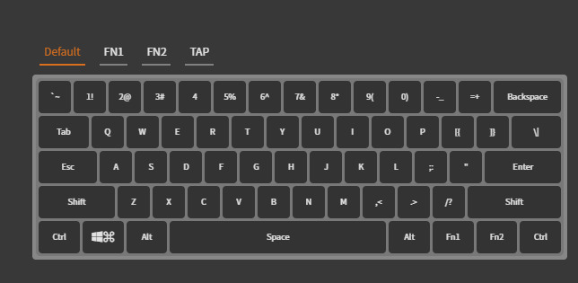
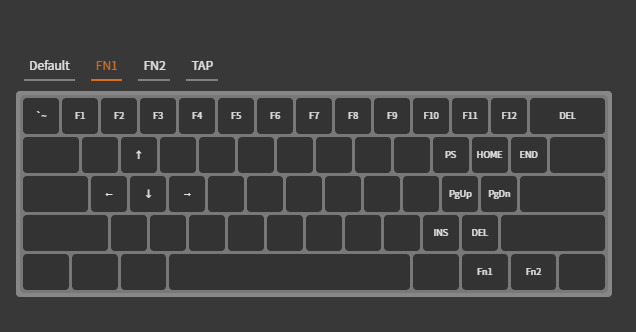
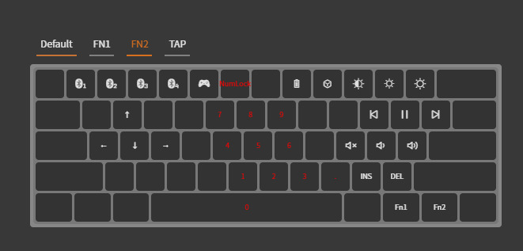
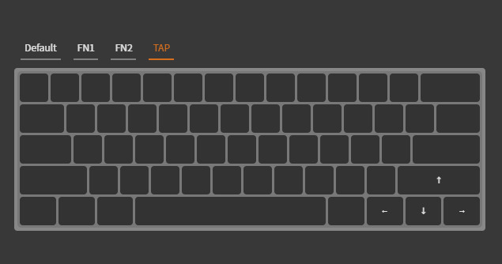

# My Anne Pro 2 layout and color schemes

`keyboard-layout.json` is my current keyboard layout. It's optimized for my usage of Vim and based on the US layout. It doesn't have Caps Lock (who needs it anyway?).

#### Default layer:

#### FN1 layer:

#### FN2 layer:

#### Tap layer:

Also, in the color-schemes folder you can find some of the lighting configs I use
